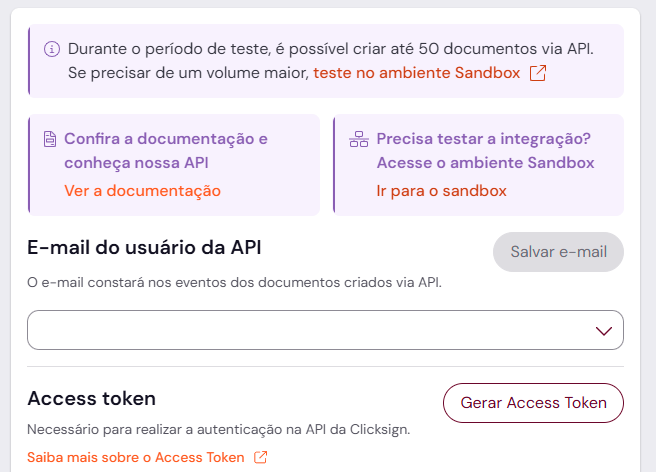
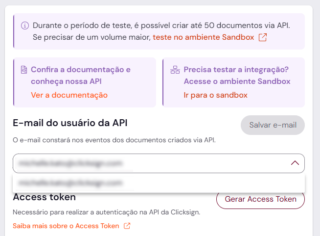

# clickdrive-migrator

Migrador de documentos: envia arquivos e pastas de um caminho local para o Click.Drive via CLI, preservando a estrutura de pastas e tratando duplicidades automaticamente.

## Pré-requisitos

O script requer **Node.js 18 ou superior** (inclui o `npm`). Ele funciona da mesma forma em Windows, macOS e Linux.

| Sistema | Como instalar |
|---|---|
| Windows | Baixe o instalador LTS em [nodejs.org](https://nodejs.org/) e execute-o, ou instale via [nvm-windows](https://github.com/coreybutler/nvm-windows). |
| macOS | `brew install node` (via [Homebrew](https://brew.sh/)), ou baixe o instalador LTS em [nodejs.org](https://nodejs.org/). |
| Linux | Use o gerenciador de pacotes da distro (ex: `sudo apt install nodejs npm` no Ubuntu/Debian) ou, para ter controle de versão, o [nvm](https://github.com/nvm-sh/nvm). |

Para confirmar a instalação:

```bash
node --version
npm --version
```

## Instalação

```bash
git clone <url-deste-repositorio>
cd clickdrive-migrator
npm install
```

## Configuração

Copie o arquivo de exemplo e preencha com as credenciais da sua conta:

```bash
# Linux, macOS, Git Bash ou WSL
cp .env.example .env
```

```powershell
# Windows (PowerShell)
Copy-Item .env.example .env
```

```cmd
 Windows (cmd.exe)
copy .env.example .env
```

| Variável | Descrição |
|---|---|
| `CLICKDRIVE_API_URL` | URL base da api-clickdrive (ex: `http://localhost:8080`) |
| `CLICKDRIVE_TOKEN` | Token de sessão do Tavola, sem o prefixo `Bearer` |

### Como obter o `CLICKDRIVE_TOKEN`

Se você já tem um token criado para esta integração, apenas copie e cole o valor em `CLICKDRIVE_TOKEN`. Caso ainda não tenha um, gere um novo:

1. **Gere um Access Token**
   - Faça login na sua conta.
   - Vá em **Configurações** e depois em **API**.
   - Clique em **Gerar Access Token**.
   - Preencha uma descrição e clique em **Gerar**.
   - Copie e guarde o token.

   

2. **Associe o usuário à API**
   - Na mesma tela onde o token foi gerado, associe seu e-mail à API e clique em **Salvar e-mail**.

   

## Uso

```bash
node script-main.js "./caminho-para-pasta/arquivo.doc"
node script-main.js "/home/usuario/financeiro"
```

- Se o caminho informado for um **arquivo**, ele é enviado diretamente para a raiz do workspace no Click.Drive.
- Se o caminho informado for uma **pasta**, o script cria essa pasta na raiz do workspace e replica toda a árvore de subpastas e arquivos dentro dela, criando cada pasta necessária antes de enviar seus arquivos.

### Duplicidade

Quando a api-clickdrive responde `409 Conflict` (já existe um arquivo ou pasta com o mesmo nome naquele local), o script **não** tenta reenviar o item para o Click.Drive. Em vez disso, ele move o arquivo (ou a pasta inteira, com seu conteúdo) para uma subpasta `duplicated` criada **no próprio caminho local**, ao lado do item original, e segue migrando o restante normalmente.

Exemplo: se `/home/usuario/financeiro/contratos/contrato1.txt` conflitar no Click.Drive, o arquivo é movido localmente para `/home/usuario/financeiro/contratos/duplicated/contrato1.txt`.

### Logs

Cada execução grava um arquivo em `logs/migration-<timestamp>.log` com todos os arquivos processados, pastas criadas, uploads concluídos e falhas, além de exibir o mesmo conteúdo no console.

### Códigos de saída

| Código | Significado |
|---|---|
| `0` | Migração concluída sem falhas |
| `1` | Uso inválido, configuração ausente, caminho inexistente ou pelo menos uma falha durante a migração |

